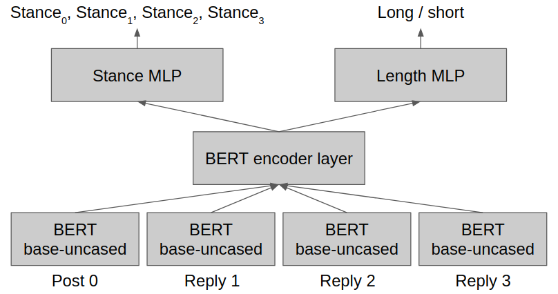
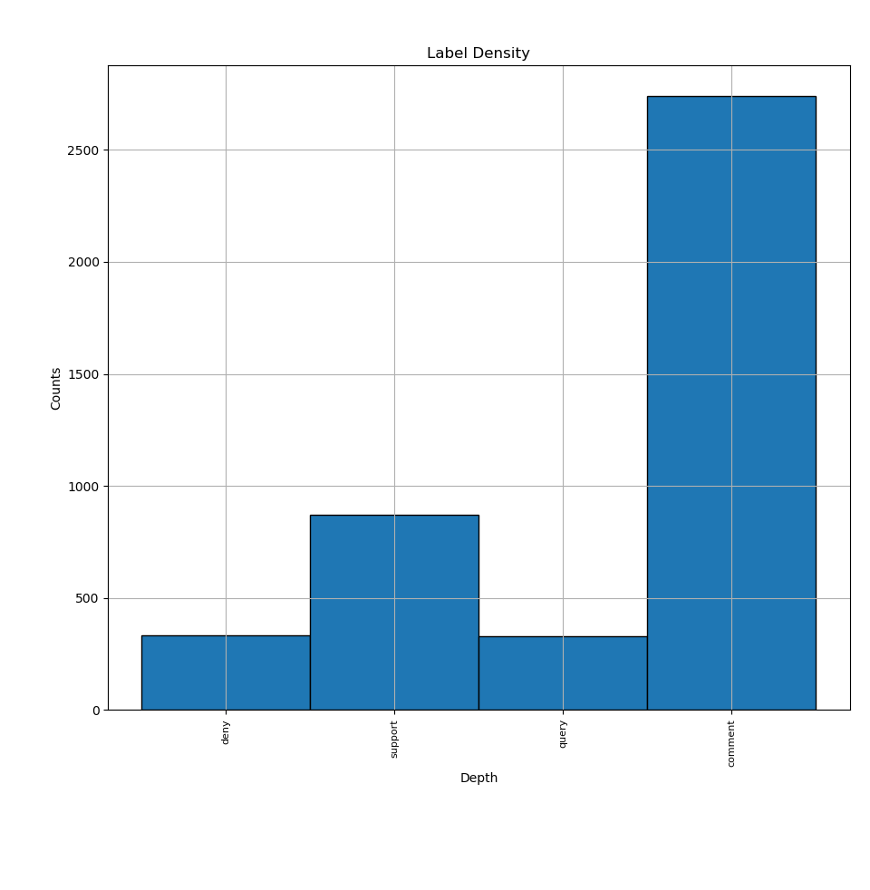
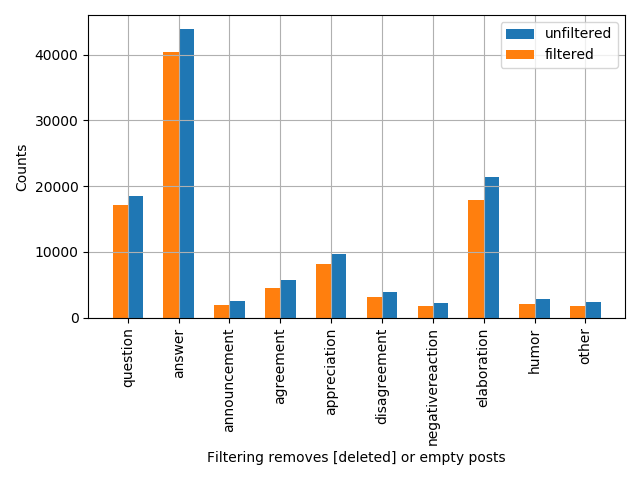
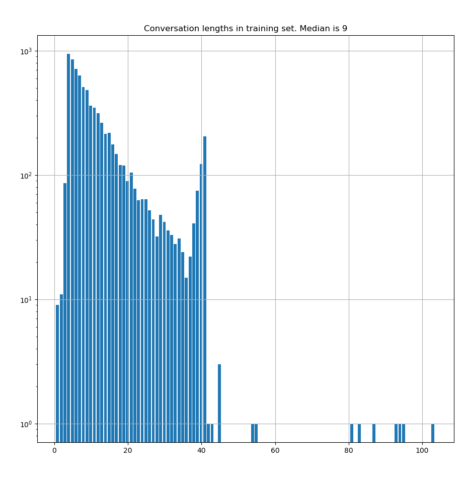

# ***MultiTaskLearning Repo***

This repo is to experiment with multitask learning. There are 2 tasks at hand.    
The performance of the joint training should be better than doing tasks separately.    

### **Tasks**    
**1. Length Prediction of Conversation Threads:**    
Given some starting posts in a thread, predict how long the thread will last.    
This will be framed as a binary classfication problem.

**2. Stance Analysis:**    
Figure out the stance of social media posts.    
This is a multiclass classification problem.

### **Models**     
The base model used is shown here.

    

The BERT attention layer tried so far is only 1 layer.    
TODO: try deeper layers
    
### **Datasets used**        
There were 2 datasets used in this work
    
**1. SemEval17 (Specifically, Task 8-Subtask A)**    
Tweets are labelled according to their stance towards a parent post    
    
    0 = Deny
    1 = Support
    2 = Query
    3 = Comment

Here's how their label density looks like

    

**2. Coarse Discourse Dataset (From Convokit)**    
A bunch of reddit threads.
Posts have the following labels

    Question
    Answer
    Announcement
    Agreement
    Appreciation
    Disagreement
    Negative Reaction
    Elaboration
    Humor
    Other
    
Here's how their label density looks like

    

### **Pre-processing of datasets**    
The first thing to do is to merge both datasets into 1.    
Convert Coarse Discourse labels into SemEval labels as follows.    

    Question      --> Query
    Answer        --> Comment
    Announcement  --> Comment
    Agreement     --> Support
    Appreciation  --> Comment
    Elaboration   --> Comment
    Humor         --> Comment
    Other         --> Comment
    Disagreement  --> Deny
    Neg. Reaction --> Deny

Next, take care of thread lengths. Here's a histogram of the distribution in the training set.    
The x-axis represents thread length., y-axis means length frequency.    

    

To define whether a conversation is long, I split it along the median or 9.     
i.e. Threads with lengths. >=9 are long
Backstrom et. al. (2013) split their facebook data at 8, also a median length.    

I decided to look at the first N number of posts, then predict whether the conversation will be "long". I set N=4.    
Zhang et. al. (2018) set N=2 only for their toxicity prediction task.

Each thread is now framed as    
- Post0
- Reply1
- Reply2
- Reply3
- Final thread length
- Post0 stance label
- Reply1 stance label
- Reply2 stance label
- Reply3 stance label

Since N is 4, any thread that is length 2 or 3 is problematic when it comes to training for stance classification.    
To handle such situations, I stuck in empty posts and created a annotated them with a new label - 'isEmpty'

10% used as a test set    
10% used as a validation set (fixed, k-folds not implemented)    
80% used as training set

### **Other Important Stuff**    

#### *Optimizers:*   
* **Base SGD** 
    * LR=0.0005, Moment=0.125, batchsize=24, flat_stance_weights,epochs=20 (exp1)
    * LR=0.0005, Moment=0.250, batchsize=24, flat_stance_weights,epochs=20 (exp2)
    * LR=0.0005, Moment=0.500, batchsize=24, flat_stance_weights,epochs=20 (exp3)
    * Try other combo of LR, momentum and weighted stance loss functions later
* **ADAM**
    * LR=0.00005, batchsize=25 flat_stance_weights, epochs=10 (exp4)
    * LR=0.00010, batchsize=25 flat_stance_weights, epochs=10 (exp5)
    * LR=0.00020, batchsize=25 flat_stance_weights, epochs=10 (exp6)

#### *Loss Functions:*   
* Uniform cross entropy loss (multiclass for stance, binary for length)
* TODO: Weighted cross entropy loss for stance

### **Experiment Results**    

Training using base SGD optimizers didn't work for stance prediction. Cannot learn DENY class

**Experiment 1**     

Stance |Precision|Recall|F1 score|Support
-------|---------|------|--------|-------
isEmpty|1.0000|1.0000|1.0000|345
Deny   |0.0000|0.0000|0.0000|78   
Support|0.8063|0.7984|0.8023|1032
Query  |0.7647|0.7521|0.7583|242
Comment|0.8851|0.9133|0.8990|2227
Average|      |      |0.6914

Length |Precision|Recall|F1 score|Support
-------|---------|------|--------|-------
Short  |0.7575|0.4872|0.5930|468
Long   |0.6471|0.8577|0.7376|513   
Average|      |      |0.6653
Accuracy|     |      |68.1%

**Experiment 2**    

Labels |Precision|Recall|F1 score|Support
-------|---------|------|--------|-------
isEmpty|1.0000|1.0000|1.0000|345
Deny   |0.0000|0.0000|0.0000|78   
Support|0.8411|0.7849|0.8120|1032
Query  |0.6870|0.7438|0.7143|242
Comment|0.8776|0.9273|0.9017|2227
Average|      |      |0.6661

Length |Precision|Recall|F1 score|Support
-------|---------|------|--------|-------
Short  |0.6826|0.5791|0.6266|468
Long   |0.6627|0.7544|0.7056|513   
Average|      |      |0.6856
Accuracy|     |      |67.1%

**Experiment 3**

Labels |Precision|Recall|F1 score|Support
-------|---------|------|--------|-------
isEmpty|1.0000|1.0000|1.0000|345
Deny   |0.5000|0.0256|0.0488|78   
Support|0.8618|0.8275|0.8443|1032
Query  |0.6955|0.7645|0.7283|242
Comment|0.8909|0.9273|0.9087|2227
Average|      |      |0.7060

Length |Precision|Recall|F1 score|Support
-------|---------|------|--------|-------
Short  |0.7143|0.5235|0.6042|468
Long   |0.6505|0.8090|0.7211|513
Average|      |      |0.6627
Accuracy|     |      |67.3%

Training with ADAM seem to work better
Experiment 4 length accuracy = 59.9%    

**Experiment 4** 

Labels |Precision|Recall|F1 score|Support
-------|---------|------|--------|-------
isEmpty|1.0000|1.0000|1.0000|345
Deny   |0.0976|0.0513|0.0672|78   
Support|0.8606|0.8672|0.8639|1032
Query  |0.7662|0.7314|0.7484|242
Comment|0.9034|0.9196|0.9114|2227
Average|      |      |0.7182

Length |Precision|Recall|F1 score|Support
-------|---------|------|--------|-------
Short  |0.5887|0.5321|0.5589|468
Long   |0.6075|0.6608|0.6331|513
Average|      |      |0.5960
Accuracy|     |      |59.9%

**Experiment 5** 

Labels |Precision|Recall|F1 score|Support
-------|---------|------|--------|-------
isEmpty|1.0000|1.0000|1.0000|345
Deny   |0.2667|0.1026|0.1481|78   
Support|0.8375|0.8391|0.8383|1032
Query  |0.7512|0.6736|0.7102|242
Comment|0.8851|0.9133|0.8990|2227
Average|      |      |0.7191

Length |Precision|Recall|F1 score|Support
-------|---------|------|--------|-------
Short  |0.5773|0.6944|0.6305|468
Long   |0.6579|0.5361|0.5908|513
Average|      |      |0.6106
Accuracy|     |      |61.2%

**Experiment 6** 

Results not meaningful.
    

### **Discussion**

So far, I am near / exceeding Backstrom's length prediction accuracy. But the stance prediction task isn't very good.    
There are more modern papers, but I don't really understand their metrics. An example is the Spearman Rho score in Kowalczyk et. al. (2019)    
I haven't tried to compare against them yet.

### **Further steps**    
1. Strengthen the model
    * Stack attention layers higher
    * Restore twitter keywords and URLs
2. Abalation Study
    * Train the network for stance only
    * Train the network for length prediction only
    * Remove middle attention network, straight into MLPs
3. Use a other models for comparison
    * BOW regression?

## **References**
[1] Backstrom, L., Kleinberg, J., Lee, L., & Danescu-Niculescu-Mizil, C. (2013). Characterizing and curating conversation threads: Expansion, focus, volume, re-entry. WSDM 2013 - Proceedings of the 6th ACM International Conference on Web Search and Data Mining, 13–22. https://doi.org/10.1145/2433396.2433401

[2] Zhang, J., Chang, J. P., Danescu-Niculescu-Mizil, C., Dixon, L., Thain, N., Hua, Y., & Taraborelli, D. (2018). Conversations gone awry: Detecting early signs of conversational failure. ACL 2018 - 56th Annual Meeting of the Association for Computational Linguistics, Proceedings of the Conference (Long Papers), 1, 1350–1361. https://doi.org/10.18653/v1/p18-1125

[3] Kowalczyk, D. K., & Larsen, J. (2019). Scalable privacy-compliant virality prediction on twitter? CEUR Workshop Proceedings, 2328(Cohen), 12–27.