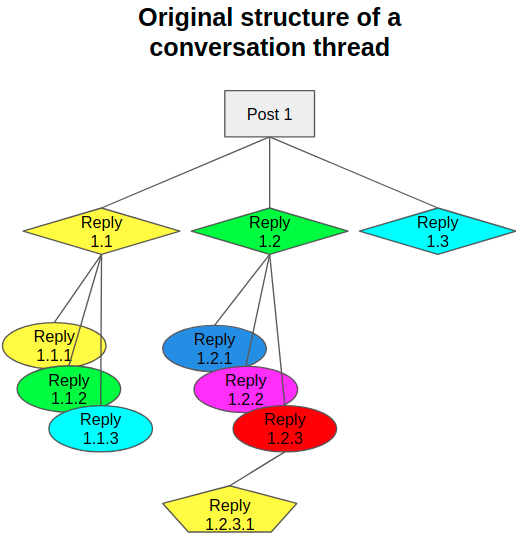
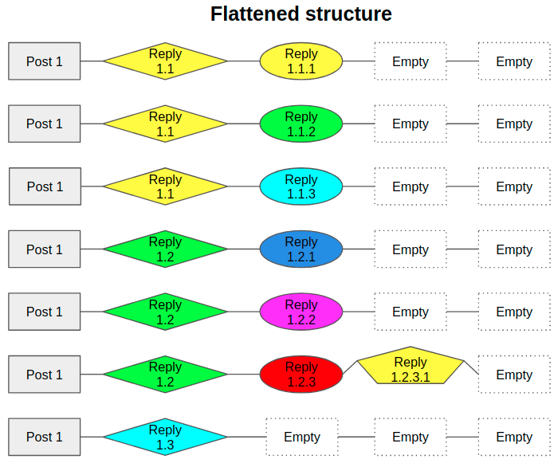
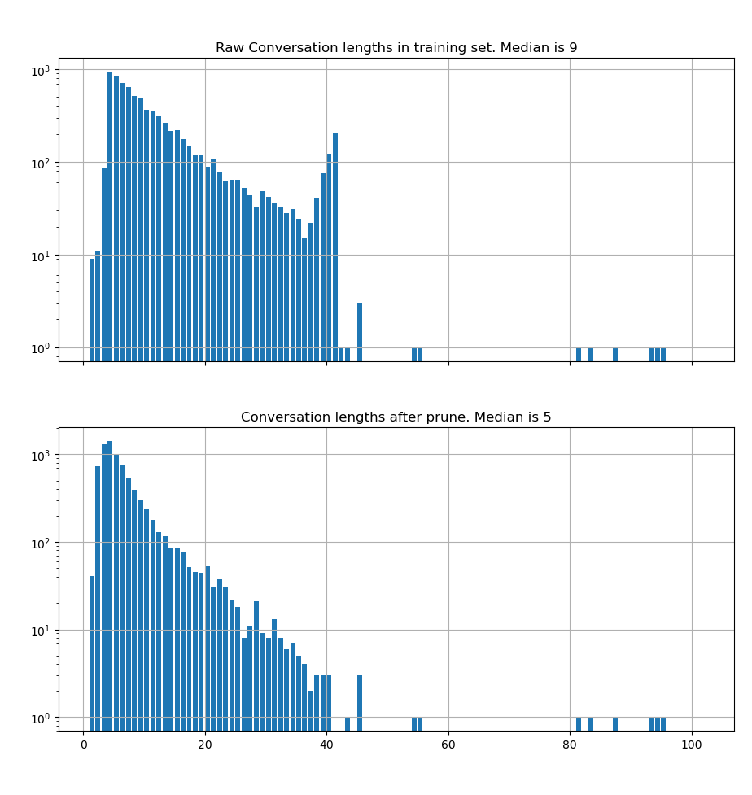
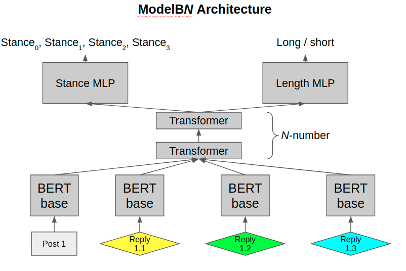
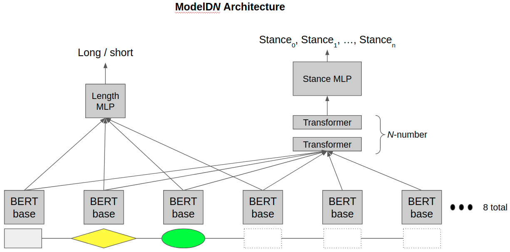

# ***MultiTaskLearning Repo***

This repo is to experiment with multitask learning. There are 2 tasks at hand.    
The performance of the joint training should be better than doing tasks separately.    

### **Tasks**    
**1. Length Prediction of Conversation Threads:**    
Given some starting posts in a thread, predict how long the thread will last.    
This will be framed as a binary classfication problem.

**2. Stance Analysis:**    
Figure out the stance of social media posts.    
This is a multiclass classification problem.

### **Datasets used**        
There were 3 datasets used in this work to train the models. The first 2 were used for training the models. The last was used for testing on totally unseen data.
    
**1. SemEval17 (Specifically, Task 8-Subtask A)**    
Tweets are labelled according to their stance towards a parent post    
    
    0 = Deny
    1 = Support
    2 = Query
    3 = Comment

Here's how their label density looks like

    

In this dataset, each thread comprises of only a root post and multiple replies to the root. 

**2. Coarse Discourse Dataset (From Convokit)**    
A bunch of reddit threads.
Posts have the following labels

    Question
    Answer
    Announcement
    Agreement
    Appreciation
    Disagreement
    Negative Reaction
    Elaboration
    Humor
    Other
    
Here's how their label density looks like

    

In this dataset, the data is structured as trees. For models named A,B,C in my experiments, I made use of only the posts that replied to root. For models named D and beyond, I used the flattened tree structure and took in more data. To illustrate more clearly what's happening, here's how an example conversation thread looks like.

    

To feed the conversations into the training models, I flattened them into paths from root to leaf nodes as follows

    

Later when doing the train-test-dev split, I took care to ensure entire conversation threads were chosen for each split. To be clearer, if a particular conversation was chosen to go into the test set, all its root-to-leaf paths will be allocated to the test set.

**3. SRQ Dataset**    
Dataset published in [4]. 5220 labelled examples of twitter post-response pairs. The labels are 

    Comment (1348 samples)
    Explicit Denial (1595 samples)
    Implicit Denial (483 samples)
    Explicit Support (388 samples)
    Implicit Support (1236 samples)
    Queries (170 samples)

This dataset is merely used as a test set at the end to evaluate the stance categories.    
The labels are remapped as follows 
    
    Comment          --> Comment
    Explicit Denial  --> Deny
    Implicit Denial  --> Deny
    Explicit Support --> Support
    Implicit Support --> Support
    Queries          --> Query
    

### **Pre-processing of datasets**    
The first thing to do is to merge both datasets into 1.    
Convert Coarse Discourse labels into SemEval labels as follows.    

    Question      --> Query
    Answer        --> Comment
    Announcement  --> Comment
    Agreement     --> Support
    Appreciation  --> Comment
    Elaboration   --> Comment
    Humor         --> Comment
    Other         --> Comment
    Disagreement  --> Deny
    Neg. Reaction --> Deny

Next, take care of thread lengths. Here's a histogram of the distribution in the training set.    
The x-axis represents thread length., y-axis means length frequency.    

    

HL pointed out that the data lengths seem truncated @ length 40. Turns out the coarse discourse dataset is indeed like that. Not sure why though.  

To define whether a conversation is long, I split it along the median or 9.     
i.e. Threads with lengths. >=9 are long
Backstrom et. al. (2013) split their facebook data at 8, also a median length.    

I decided to look at the first N number of posts, then predict whether the conversation will be "long". I set N=4.    
Zhang et. al. (2018) set N=2 only for their toxicity prediction task.

Each thread is now framed as    
- Post0
- Reply1
- Reply2
- Reply3
- Final thread length
- Post0 stance label
- Reply1 stance label
- Reply2 stance label
- Reply3 stance label

Since N is 4, any thread that is length 2 or 3 is problematic when it comes to training for stance classification.    
To handle such situations, I stuck in empty posts and created a annotated them with a new label - 'isEmpty'

10% used as a test set    
10% used as a validation set (fixed, k-folds not implemented)    
80% used as training set

### **Models**     
The base model, ModelA0 is shown here.

    

For this model, I alternated between training stance and lengths for each minibatch seen.

The next model tried shares the transformer layers in between the MLP and BERT. 

    

In the above models, HL mentioned that my method is quite wasteful wrt labelled data --> By only considering the posts that reply to root, I discarded a lot of training data. To avoid doing that, I made a 3rd model to look at all the data sequentially (i.e. further down the chain). Here's how it looks    

    

For ModelDN, apart from just looking deeper down the thread, I also changed other things compared to earlier models. First, I trained ONLY on the coarse discourse dataset. I also used the labels for the original 10 classes (announcement, humor, agree, disagree, etc)

Finally, for ModelDN, I only looked at the first 4 posts to try to make a prediction about how many posts are inside this particular tree.

### **Other Important Stuff**    

Here's a summary of the stuff tried. It is just a short explanation. See [this file](./misc/experiment_results.ods) for full settings of each experiment and full results.

*Optimizers:*   
Tried *Base SGD*, *ADAM*.    

*Loss Functions:*   
Tried uniform cross entropy loss (multiclass for stance, binary for length)    
as well as weighted cross entropy for stance (1, 10, 1, 5, 1). Deny=10, query=5    

*Learning rates (LR)*    
Most of the experiments have LR set to 10e-4, 2x10e-4, 5x10e-4.
Some have dual learning rates (ModelC). See excel file for actual data.

### **Experiment Results**    

Training using base SGD optimizers didn't work for stance prediction. 
Cannot learn DENY class. Probably too slow or something. 
Training with ADAM seem to work better

Full set of results stored in [this file](./misc/experiment_results.ods).
Results shown below are the more interesting ones. 

**Experiment 29 (Best in Length Prediction F1 score)**   
ModelB3
* Trained on 4 stance categories, thread lengths split at 9
* 3 transformer layers stacked on top of BERT
* Weighted loss function for stance
* 256 tokens/post
* Looked up 4 posts/thread for both tasks
* Minibatch size=15
* num GPUs=5
* Training took 5h15m

Labels |Precision|Recall|F1 score|Support
-------|---------|------|--------|-------
isEmpty|1.0000|1.0000|1.0000|345
Deny   |0.2769|0.2308|**0.2517**|78   
Support|0.8338|0.8605|0.8469|1032
Query  |0.7186|0.781|0.7485|242
Comment|0.9149|0.8981|0.9064|2227
F1 avg |      |      |0.7507|
F1 wo isEmpty||      |0.6884|
W.avg F1 wo isEmpty|||0.8643|
Acc.   |      |      |**87.7%**|
F1 on SRQ dataset||  |**0.4303**|

Length |Precision|Recall|F1 score|Support
-------|---------|------|--------|-------
Short  |0.7391|0.5449|0.6273|468
Long   |0.6651|0.8246|0.7363|513
Average|      |      |**0.6818**
Accuracy|     |      |**69.1%**

**Experiment 38 (Best in Deny F1 score)**   
ModelD1
* Trained on 10 stance categories, thread lengths split at 8
* *1* transformer layers stacked on top of BERT
* Weighted loss function for stance
* 256 tokens/post
* Looked up 8 posts/thread for stance task
* Looked up 4 posts/thread for length task
* Minibatch size=8
* num GPUs=2
* Training took 16h

Labels   |Precision|Recall|F1 score|Support
---------|---------|------|--------|-------
isEmpty  |1.0000|1.0000|1.0000|29890
Question |0.8562|0.8804|0.8681|5537
Answer   |0.7283|0.7844|0.7553|4587
Annouce  |0.6238|0.4436|0.5185|1267
Agreement|0.5558|0.4506|0.4977|486
Apprec   |0.6759|0.7140|0.6944|923
Disagree |0.3053|0.4856|**0.3749**|418
-ve Reaction|0.1152|0.5141|0.1882|177
Elaborate|0.4533|0.4172|0.4345|1908
Humor    |0.1357|0.0964|0.1127|280
Other    |0.2020|0.0994|0.1332|1439
F1 avg   |      |      |0.5070|
F1 wo isEmpty|  |      |0.4578|
W.avg F1 wo isEmpty||  |0.6494|
Acc.     |      |      |65.6%|
F1 on SRQ dataset||    |0.3706|

Length |Precision|Recall|F1 score|Support
-------|---------|------|--------|-------
Short  |0.2435|0.5102|0.3297|1127
Long   |0.8424|0.6230|0.7163|4737
Average|      |      |0.5230
Accuracy|     |      |60.1%

### **Discussion**

So far, I am near / exceeding Backstrom's length prediction accuracy. But the stance prediction task isn't very good.    
There are more modern papers, but I don't really understand their metrics. An example is the Spearman Rho score in Kowalczyk et. al. (2019)    

In Kowalczyk et. al. (2019), they framed the problem as a regression problem. So their metrics of error are different I guess.    
Accuracy isn't relevant in their use case. But they did use other features to get their results (eg. follower count, num likes, account age etc.)    

In the various ModelCs, I tried to make the length task learn faster compared to the stance task. I did it by forcing the learning rate of the length loss to be 3x that of the stance loss. My gut feeling is ADAM will adjust away this hardcoded behavior after several steps though. The stance prediction task does miserably in this set up.    

Perhaps it might be easier to do double stepping the length prediction task. In pseudo code:

1. *for each minibatch:*    
    1.1 *learn the length*    
    1.2 *learn the stance*    
    1.3 *learn the length again*

Double stepping the learning for length seems to work well. The performance in experiment 29 was achieved in this manner.    
The modelDNs seem to be learning the disagree/deny class well, but it is at the expense of the agree/support class. Perhaps I need to adjust the loss function weights a bit more.    

For experiment 29, I reached the performance metrics published in [4], marginally. 

For training modelD*N*s, the manner I am splitting the data will make the posts higher up the hierarchy get seen a lot more times in training than the leaf nodes. I am wondering if this this is a potential problem. 

One thing I noticed is that even though the tree sizes are split at median 8 for the dataset, when they get flattened into leaf-to-root paths, a disproportionate number of these paths come from the conversations with bigger number of members. To illustrate the problem, see experiment 38 length results 'support' column. Even though roughly 50% of conversations have 8 or more posts inside, when flattened into individual leaf-to-root paths, these conversations account for 80% of the paths. Not sure whether this is a problem. Perhaps I should re-frame the length prediction task as predicting "will this specific path will end soon?"    

### **Further steps**    
1. Strengthen the model
    * ~~Stack attention layers higher~~
    * ~~Restore URLs~~ [Doesn't seem necessary. Some papers keep URLs, others filter them]
    * ~~Double stepping the learning for length~~
2. Abalation Study
    * Train the network for stance only
    * Train the network for length prediction only
    * Remove middle attention network, straight into MLPs
3. Build another entirely different model
    * ~~2 entirely separate networks to not discard posts. Share only underlying BERT~~
    * Stack transformers before the length MLP also

## **References**
[1] Backstrom, L., Kleinberg, J., Lee, L., & Danescu-Niculescu-Mizil, C. (2013). Characterizing and curating conversation threads: Expansion, focus, volume, re-entry. WSDM 2013 - Proceedings of the 6th ACM International Conference on Web Search and Data Mining, 13–22. https://doi.org/10.1145/2433396.2433401

[2] Zhang, J., Chang, J. P., Danescu-Niculescu-Mizil, C., Dixon, L., Thain, N., Hua, Y., & Taraborelli, D. (2018). Conversations gone awry: Detecting early signs of conversational failure. ACL 2018 - 56th Annual Meeting of the Association for Computational Linguistics, Proceedings of the Conference (Long Papers), 1, 1350–1361. https://doi.org/10.18653/v1/p18-1125

[3] Kowalczyk, D. K., & Larsen, J. (2019). Scalable privacy-compliant virality prediction on twitter? CEUR Workshop Proceedings, 2328(Cohen), 12–27.

[4] Villa-Cox, R., Kumar, S., Babcock, M., & Carley, K. M. (2020). Stance in Replies and Quotes (SRQ): A New Dataset For Learning Stance in Twitter Conversations. http://arxiv.org/abs/2006.00691